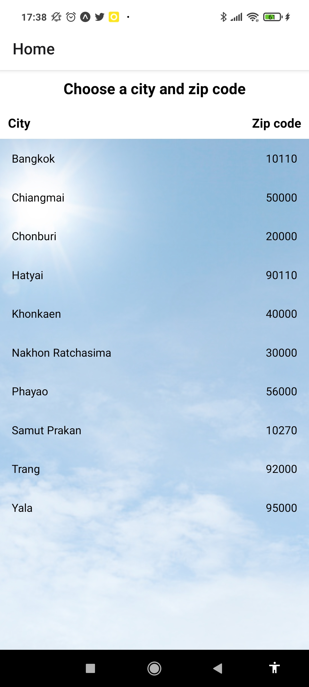

# 6. งานหลังการทดลอง

## นายธีรยุทธ นุชผดุง 6210110149 Sec02

## 1.) หน้าเลือกจังหวัดและรหัสไปรษณีย์

1. เพิ่มส่วนของหัวตาราง 
2. เพิ่มภาพพื้นหลัง และใส่พื้นหลังเป็นสีขาวแบบโปร่งใส 
3. เพิ่มจังหวัด คือ Bangkok, Nakhon Ratchasima, Phayao, Samut Prakan, Yala

## 2.) หน้าแสดงสภาพอากาศ

1. เพิ่มข้อมูลในส่วนของ 
    - ความเร็ว, ทิศทางลม 
    - ความชื้นสัมพัทธ์, ความดันบรรยากาศ 
    - อุณหภูมิต่ำสุดและสูงสุดของวัน 
    โดยทำการดึงข้อมูลมาจาก https://openweathermap.org/current#current_JSON 
2. เพิ่ม Icon ระบุสภาพอากาศใน Description 
3. เพิ่มเงื่อนไขในการแสดงภาพพื้นหลัง โดย 
    - หากมีเมฆ (Clouds) พื้นหลังจะเปลี่ยนเป็นรูปเมฆ 
    
    - หากมีฝนตก (Rain) พื้นหลังจะเปลี่ยนเป็นรูปฝนตก 
    
    - หากท้องฟ้าแจ่มใส (Clear) พื้นหลังจะเป็นรูปท้องฟ้าแจ่มใส (เนื่องจากไม่มีที่ใดที่ท้องฟ้าแจ่มใส จึงใส่เป็นรูปแทนภาพหน้าจอ) 
    
    - หากเกิดพายุฝนฟ้าคะนอง (Thunderstorm) พื้นหลังจะเป็นรูปฟ้าผ่า (เนื่องจากไม่มีที่ใดที่เกิดพายุฝนฟ้าคะนอง จึงใส่เป็นรูปแทนภาพหน้าจอ) 
    
ข้อมูล Icon และเงื่อนไขสภาพอากาศ นำมาจาก https://openweathermap.org/weather-conditions 
4. จัดตำแหน่งให้ข้อมูลทั้งหมดอยู่ตรงกลางหน้าจอ 
5. ใส่พื้นหลังเป็นสีดำแบบโปร่งใส และทำตัวอักษรทั้งหมดให้เป็นสีขาว 

## -ภาพหน้าจอทั้งหมดอยู่ใน wt-app/images/screenshots-